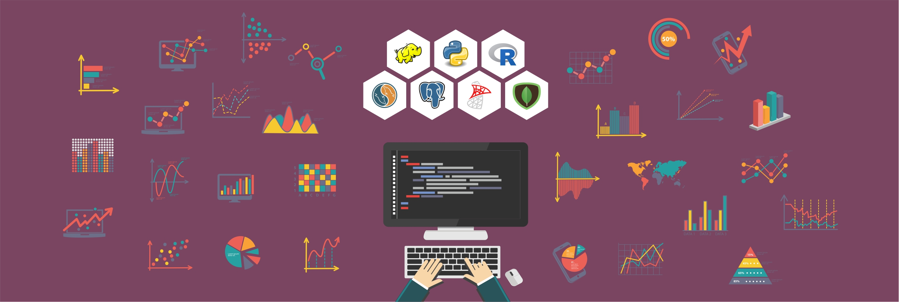

# Data Science Projects

Projects in Data Science, Machine Learning and Kaggle Competitions

## How to Open

- You can open all notebooks with Google Colab
## Content

### [Credit Card Fraud](https://github.com/rafaelmgr12/ds-projects/tree/main/Credit-Card-Fraud)
### [House Prices Advanced Regression Techniques](https://github.com/rafaelmgr12/ds-projects/tree/main/House-Prices-Advanced-Regression-Techniques)
### [Predict Future Sales](https://github.com/rafaelmgr12/ds-projects/tree/main/Predict-Future-Sales)
### [Home Credit Default Risk](https://github.com/rafaelmgr12/ds-projects/tree/main/Home-Credit-Default-Risk)