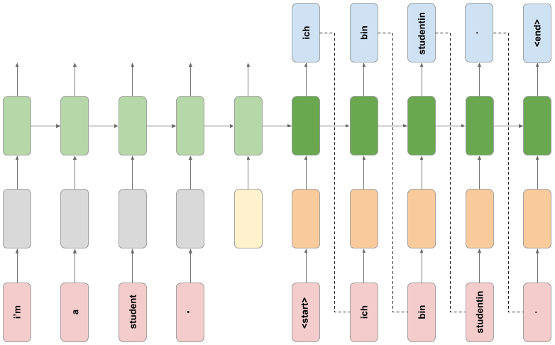

# Neural Network Translantion
## Final Project

This a final Project for the course [**Customising your models with TensorFlow 2**](https://www.coursera.org/learn/customising-models-tensorflow2)

In this Capstone Project, you will create a neural network that translates from English to German. 

You will use concepts from throughout this course, including building more flexible model architectures, freezing layers, data processing pipeline and sequence modelling.

This is the Capstone Project notebook. Refer to the following peer-graded assignment item for instructions on completing the project. 

### How it works
